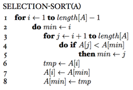

### Exercises 2.2-1
***
Express the function 
 in terms of Θ-notation.

### `Answer`
Θ(n3)

### Exercises 2.2-2
***
Consider sorting n numbers stored in array A by first finding the smallest element of A and exchanging it with the element in A[1]. Then find the second smallest element of A, and exchange it with A[2]. Continue in this manner for the first n - 1 elements of A. Write pseudocode for this algorithm, which is known as **selection sort**. What loop invariant does this algorithm maintain? Why does it need to run for only the first n - 1 elements, rather than for all n elements? Give the best-case and worst-case running times of selection sort in Θ- notation.

### `Answer`

时间都是Θ()

### Exercises 2.2-3
***
Consider linear search again (see Exercise 2.1-3). How many elements of the input sequence need to be checked on the average, assuming that the element being searched for is equally likely to be any element in the array? How about in the worst case? What are the average-case and worst-case running times of linear search in Θ-notation? Justify your answers.

### `Answer`
* 平均情况应该要查找n/2个元素
* 最坏情况是n个

* Assuming equal probability of occurrence, average number of elements which need to be checked is n/2. Running time is Θ(n)
* Worst case, the element to search is dead last in the array. In that case n elements need to be searched. Running time is Θ(n)

所以都是Θ(n)

### Exercises 2.2-4
***
How can we modify almost any algorithm to have a good best-case running time?

### `Answer`
投机取巧，往最好情况去想

One could check whether the problem is already solved (when sorting, for instance, check if input is already sorted).

***
Follow [@louis1992](https://github.com/gzc) on github to help finish this task.

