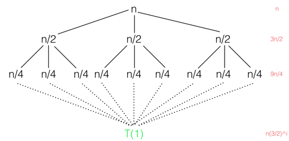
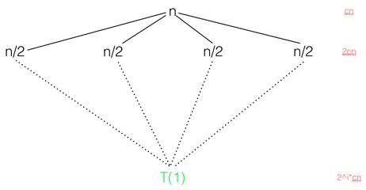
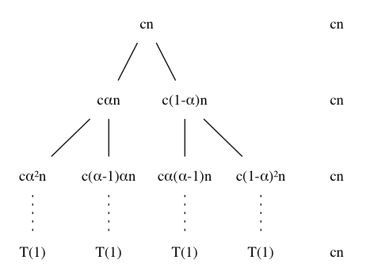

### Exercises 4.2-1
***
Use a recursion tree to determine a good asymptotic upper bound on the recurrence 
 = 3T\(\\lceil n/2 \\rceil\) + n). Use the substitution method to verify your answer.

### `Answer`

树的高度是lgn,有3^lgn个叶子节点.

 = n\\sum_{i = 0}^{lg\(n\)-1}\(\\frac{3}{2}\)^i + \\Theta\(3^{\\lg{n}}\) \\\\  ~
\\hspace{15 mm} = \\Theta\(n^{\\lg{3}}\) + \\Theta\(3^{\\lg{n}}\) \\\\  ~
\\hspace{15 mm} = \\Theta\(n^{\\lg{3}}\) + \\Theta\(n^{\\lg{3}}\) \\\\  ~
\\hspace{15 mm} = \\Theta\(n^{\\lg{3}}\)
)

我们猜想  \\le cn^{\\lg{3}}+2n )

 \\le 3c\(n/2\)^{\\lg{3}} + 2n  \\\\  ~
\\hspace{15 mm} \\le cn^{\\lg{3}}+2n  \\\\  ~
\\hspace{15 mm} = \\Theta\(n^{\\lg{3}}\)
)

### Exercises 4.2-2
***
Argue that the solution to the recurrence
 = T\(n/3\) + T\(2n/3\) + cn ) 
, where c is a constant, is Ω(nlgn) by appealing to the recurrsion tree.

### `Answer`
最短的叶子高度是lg3n,每一层都要cn.也就是说，只考虑最短叶子的那一层（忽略其他层）已经有cnlg3n.

### Exercises 4.2-3
***
Draw the recursion tree for 
 = 4T\(\\lfloor n/2 \\rfloor\) + cn)
,where c is a constant, and provide a tight asymptotic bound on its solution. Verify your bound by the substitution method.
### `Answer`

很明显是n^2的级别

我们假设  \\le n^2+2cn)

 \\le  4c\(n/2\)^2 + 2cn/2+cn \\le cn^2+2cn)

我们假设  \\ge n^2+2cn)

 \\ge  4c\(n/2\)^2 + 2cn/2+cn \\ge cn^2+2cn)

### Exercises 4.2-4
***
Use a recursion tree to give an asymptotically tight solution to the recurrence T(n) = T(n - a) + T(a) + cn, where a ≥ 1 and c > 0 are constants.

### `Answer`

file:///Users/ganzhenchao/Workspaces/CLRS/C04-Recurrences/repo/s2/4.png
  = \\sum_{i=0}^{n/a}c\(n-ia\) + \(n/a\)ca
= \\Theta\(n^2\))

我们假设  \\le cn^2)

 \\le c\(n-a\)^2 + ca + cn  \\\\  ~
\\hspace{15 mm} \\le cn^2-2acn+ca+cn  \\\\  ~
\\hspace{15 mm} \\le cn^2-c\(2an-a-n\) \\\\  ~
\\hspace{15 mm}\\le cn^2 - cn ~~~~ if ~~ a > 1/2,n > 2a \\\\  ~
\\hspace{15 mm}\\le cn^2 \\\\  ~
\\hspace{15 mm} = \\Theta\(n^2\)
)

另外一个方向的证明和这个基本一样.

### Exercises 4.2-5
***
Use a recursion tree to give an asymptotically tight solution to the recurrence T(n) = T(αn) +
T((1 - α)n) + cn, where α is a constant in the range 0 <α < 1 and c > 0 is also a constant.

### `Answer`

可以假设α < 1/2,因此树的高度有

 = \\sum_{i = 0}^{\\log_{1/ \\alpha}{n}}cn + \\Theta\(n\) = cn\\log_{1/ \\alpha}{n} + \\Theta\(n\) = \\Theta\(n\\lg{n}\) )

***
Follow [@louis1992](https://github.com/gzc) on github to help finish this task.

