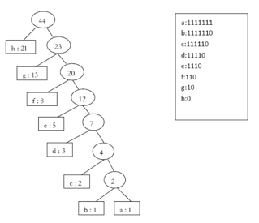

### Exercises 16.3-1
***
Prove that a binary tree that is not full cannot correspond to an optimal prefix code.
### `Answer`
要达到最优前缀编码,必须考虑到前缀的每一种情况,故必须是满二叉树.

### Exercises 16.3-2
***
What is an optimal Huffman code for the following set of frequencies, based on the first 8 Fibonacci numbers?

a:1 b:1 c:2 d:3 e:5 f:8 g:13 h:21

Can you generalize your answer to find the optimal code when the frequencies are the first n Fibonacci numbers?

### `Answer`

### Exercises 16.3-3
***
Prove that the total cost of a tree for a code can also be computed as the sum, over all internal nodes, of the combined frequencies of the two children of the node.

### `Answer`
straightforward

### Exercises 16.3-4
***
Prove that if we order the characters in an alphabet so that their frequencies are monotonically decreasing, then there exists an optimal code whose codeword lengths are monotonically increasing.

### `Answer`
straightforward

### Exercises 16.3-5
***
Suppose we have an optimal prefix code on a set C = {0, 1, ..., n - 1} of characters and we wish to transmit this code using as few bits as possible. Show how to represent any optimal prefix code on C using only 2n - 1 + n ⌈lg n⌉ bits. (Hint: Use 2n - 1 bits to specify the structure of the tree, as discovered by a walk of the tree.)

### `Answer`
用**2n-1**位表示树的结构,内部节点用1表示,叶子节点用0表示.用nlog(n)为表示字母序列,每个字母的二进制编码长度为log(n),总共需要nlog(n)位.

### Exercises 16.3-6
***
Generalize Huffman's algorithm to ternary codewords (i.e., codewords using the symbols 0, 1, and 2), and prove that it yields optimal ternary codes.

### `Answer`
那就推广到树的结点有三个孩子结点,证明过程同引理16.3的证明.

### Exercises 16.3-7
***
Suppose a data file contains a sequence of 8-bit characters such that all 256 characters are about as common: the maximum character frequency is less than twice the minimum character frequency. Prove that Huffman coding in this case is no more efficient than using an ordinary 8-bit fixed-length code.

### `Answer`
此时生成的Huffman树是一颗满二叉树,跟固定长度编码一致.

### Exercises 16.3-8
***
Show that no compression scheme can expect to compress a file of randomly chosen 8-bit characters by even a single bit. (Hint: Compare the number of files with the number of possible encoded files.)

### `Answer`
Notice that the number of possible source files S using n bit and compressed files E using n bits is 2^**n+1**  -  1. Since any compression algorithm must assign each element s ∈ S to a distinct element e ∈ E the algorithm cannot hope to actually compress the source file.

***
Follow [@louis1992](https://github.com/gzc) on github to help finish this task.

