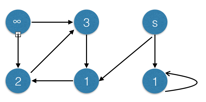
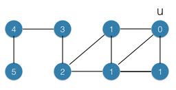
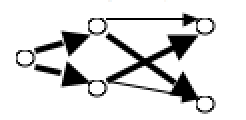

### Exercises 22.2-1
***
Show the d and π values that result from running breadth-first search on the directed graph of Figure 22.2(a), using vertex 3 as the source.

### `Answer`

### Exercises 22.2-2
***
Show the d and π values that result from running breadth-first search on the undirected graph
of Figure 22.3, using vertex u as the source.

### `Answer`

### Exercises 22.2-3
***
What is the running time of BFS if its input graph is represented by an adjacency matrix and the algorithm is modified to handle this form of input?

### `Answer`
用邻接矩阵表示的话,遍历所有的边的时间由O(E)变为O(V^2),因此总运行时间是O(V+V^2)

If the graph is represented by adjancency matrix, then the time of iterating all the edge becomes O(V^2), so the running time is O(V+V^2).

### Exercises 22.2-4
***
Argue that in a breadth-first search, the value d[u] assigned to a vertex u is independent of the order in which the vertices in each adjacency list are given. Using Figure 22.3 as an example, show that the breadth-first tree computed by BFS can depend on the ordering within adjacency lists.

### `Answer`
这些结论很明显,d[u]是最短路径的大小自然和顺序无关,而最短的路径可以有很多条自然和顺序有关.

It's obvious, d[u] represents the distance, so it is of course has nothing to do with order. But the shortest path may be not unique, so it is relevant to order.
			
			
### Exercises 22.2-5
***
Give an example of a directed graph G = (V, E), a source vertex s in V , and a set of tree edges Eπ in E such that for each vertex v in V,the unique path in the graph(V,Eπ) from s to v is a shortest path in G, yet the set of edges Eπ cannot be produced by running BFS on G, no matter how the vertices are ordered in each adjacency list.


### `Answer`
Following is the example, the bold edges are in Eπ. Then can not be produced by BFS.

### Exercises 22.2-6
***
There are two types of professional wrestlers: "good guys" and "bad guys." Between any pair of professional wrestlers, there may or may not be a rivalry. Suppose we have n professional wrestlers and we have a list of r pairs of wrestlers for which there are rivalries. Give an O(n + r)-time algorithm that determines whether it is possible to designate some of the wrestlers as good guys and the remainder as bad guys such that each rivalry is between a good guy and a bad guy. If is it possible to perform such a designation, your algorithm should produce it.

### `Answer`
Bipartite Graph problem. 

Run DFS or BFS, the start node we could mark as white. Each time, we encounter a node, if it is not currently colored, we should mark it as the opposite color of current node. Else, check the color with current node. If same, then it is not bipartite graph.

### Exercises 22.2-7
***
The **diameter** of a tree T =(V, E) is given by

	max d(u,v)
that is, the diameter is the largest of all shortest-path distances in the tree. Give an efficient algorithm to compute the diameter of a tree, and analyze the running time of your algorithm.

### `Answer`

#####Solution 1 :

For all node v, run BFS each, choose the longest shortest path. Or use floyd algorithm to calculate all p-p shortest path.

BFS running time = O(V*(V+E))

floyd running time = O(V^3)

 

#####Solution 2:

Run BFS twice. For the first time, arbitrarily choose a vertex as the source. The second time, let the vertex with largest d[] be the source.

 

#####Solution 3:

The diameter of a tree can computed in a bottom-up fashion using a recursive solution. If x is a node with a depth d(x) in the tree then the diameter D(x) must be:

	D(x) = max{maxi{D(x.childi)}, maxij{d(x.childi) + d(x.childj)} + 2}, if x is an internal node
		   0 														   , if x is a leaf
Since the diameter must be in one of the subtrees or pass through the root and the longest path from the root must be the depth. The depth can easily be computed at the same time. Using dynamic programming we obtain a linear solution.
Actually, the problem can also be solved by computing the longest shortest path from an arbi- trary node. The node farthest away will be the endpoint of a diameter and we can thus compute the longest shortest path from this node to obtain the diameter. See relevant litterature for a proof of this.


### Exercises 22.2-8
***
Let G = (V, E) be a connected, undirected graph. Give an O(V + E)-time algorithm to compute a path in G that traverses each edge in E exactly once in each direction. Describe how you can find your way out of a maze if you are given a large supply of pennies.

### `Answer`
Euler path problem.

**欧拉路径**：图中经过每条边一次且仅一次的路径；

 You can reference [here](https://github.com/gzc/sgu/blob/master/100-199/101.cpp)

一个无向图如果有一个欧拉路径,需要满足几个条件: 它的奇数度节点数要么是0要么是2(此时这两个点只能作为欧拉路径的起点和终点)

If an underected graph has an Euler path, it must satisfy : its odd dgree node is either 0 or 2.(Under such circumstance, the odd degree are start node and end node).

***
Follow [@louis1992](https://github.com/gzc) on github to help finish this task.

