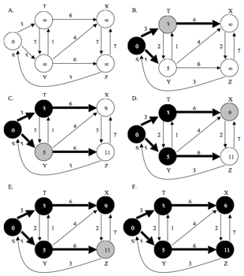
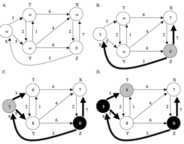
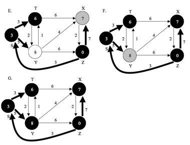
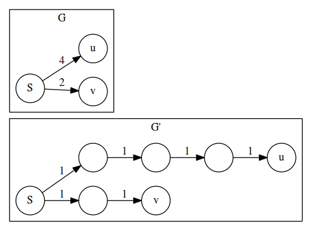

### Exercises 24.3-1
***
Run Dijkstra's algorithm on the directed graph of Figure 24.2, first using vertex s as the source and then using vertex z as the source. In the style of Figure 24.6, show the d and π values and the vertices in set S after each iteration of the while loop.
### `Answer`

### Exercises 24.3-2
***
Give a simple example of a directed graph with negative-weight edges for which Dijkstra's algorithm produces incorrect answers. Why doesn't the proof of Theorem 24.6 go through when negative-weight edges are allowed?
### `Answer`
Dijkstra算法的原理是:每次新拓展一个最近的点,更新与其相邻的点的距离,当所有边的权值都为正时,由于不会存在一个距离更短的没拓展过的点,所以这个点的距离永远不会被改变,因而保证了算法的正确性.但是这个原理有一个限制,就是边权不能为负.

### Exercises 24.3-3
***
Suppose we change line 4 of Dijkstra's algorithm to the following.

**4** while |Q| > 1

This change causes the while loop to execute |V | - 1 times instead of |V | times. Is this proposed algorithm correct?

### `Answer`
完全正确,其他点已经做过relax,不可能再更新了.否则就破坏了这个算法的基本性质.

### Exercises 24.3-4
***
We are given a directed graph G = (V, E) on which each edge (u, v) ∈ E has an associated value r(u, v), which is a real number in the range 0 ≤ r(u, v) ≤ 1 that represents the reliability of a communication channel from vertex u to vertex v. We interpret r(u, v) as the probability that the channel from u to v will not fail, and we assume that these probabilities are independent. Give an efficient algorithm to find the most reliable path between two given vertices.

### `Answer`
令w(u,v) = lg(r(u,v)),即可转化用Dijkstra算法解决.

### Exercises 24.3-5
***
Let G = (V, E) be a weighted, directed graph with weight function w : E → {1, 2, ..., W } for some positive integer W , and assume that no two vertices have the same shortest-path weights from source vertex s. Now suppose that we define an unweighted, directed graph G' = (V U V', E') by replacing each edge (u, v) ∈ E with w(u, v) unit-weight edges in series. How many vertices does G' have? Now suppose that we run a breadth-first search on G'. Show that the order in which vertices in V are colored black in the breadth-first search of G' is the same as the order in which the vertices of V are extracted from the priority queue in line 5 of DIJKSTRA when run on G.

### `Answer`
图 G 与 图 G' 的区别如下图所示:

由图可知, 对应图 G 的每一条边 (u, v), 图 G' 都会新增 w(u, v) - 1 个结点, 因此图 G' 的结点数为 

对于遍历顺序的证明:

假设在图 G 上运行 DIJKSTRA 算法时, 结点 u, v 先后从优先队列中取出. 由题意, 从源点 s 到其他各点的最短路径互不相同, 所以可以肯定 d(u) < d(v). 又因为在图 G' 上进行广度优先遍历时, 结点 u 会在第 d[u] 步染成黑色, 结点 v 则在第 d[v] 步. 因此图 G' 上结点的染色顺序与在图 G 上运行 DIJKSTRA 算法时从优先队列取出的顺序相同.

### Exercises 24.3-6
***
Let G = (V, E) be a weighted, directed graph with weight function w : E → {0, 1, ..., W } for some nonnegative integer W . Modify Dijkstra's algorithm to compute the shortest paths from a given source vertex s in O(W V + E) time.

### `Answer`
用一个二维数组A[wv]实现优先级队列.具有长度为d的节点就在A[d]的list中.

EXTRACT-MIN总共需要O(WV)的时间. 因为跑完整个算法相当于遍历了一遍数组.

DECREASE-KEY总共需要O(E)的时间. 每次检查一条边做relax,只需要根据d移动到数组A的对应位置.

### Exercises 24.3-7
***
Modify your algorithm from Exercise 24.3-6 to run in O((V + E) lg W ) time. (Hint: How
many distinct shortest-path estimates can there be in V - S at any point in time?)

### `Answer`
用binary heap实现priority queue.

### Exercises 24.3-8
***
Suppose that we are given a weighted, directed graph G = (V, E) in which edges that leave the source vertex s may have negative weights, all other edge weights are nonnegative, and there are no negative-weight cycles. Argue that Dijkstra's algorithm correctly finds shortest paths from s in this graph.

### `Answer`
这种情况下不会破坏已经更新的点的距离.

***
Follow [@louis1992](https://github.com/gzc) on github to help finish this task.

本节部分答案参考自[这里](http://blog.csdn.net/anye3000/article/details/12091125)
